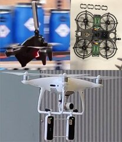
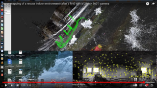
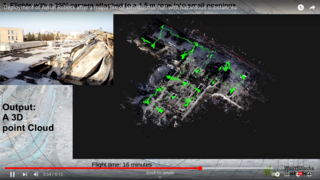
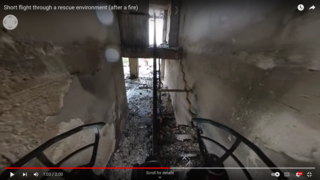
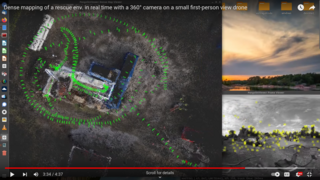
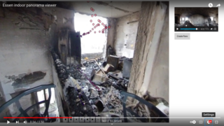

# PatchMatch 

***Additional material for the paper: "PatchMatch-Stereo-Panorama, a fast dense reconstruction from 360° video images"***

| **Abstract** — This work deals with the creation of dense 3D reconstructions based on a 360° video in order to give autonomous robots a better possibility to find their way in their environment as well as to provide different forces in operations with a quick overview of the situation. For this purpose, an already existing visual SLAM method, the OpenVSLAM, which is based on the ORB-SLAM, is extended by a PatchMatch-Stereo-Panorama algorithm. Unlike other methods, this work does not convert the panoramic images into perspective methods, but works directly on the equirectangular projection. In order to operate in real time, a parallel propagation scheme was also developed to offload the computation to the GPU. The results were then compared with structure-from-motion and multi-view stereo methods and showed significant differences.  | Example of the UAVs with 360° camera   |
|:-|-:|

**Keywords**: PatchMatch-Stereo, 360°-Panorama, visual monocular SLAM, UAV, Rescue Robotics

## Videos (at youtube):

Dense mapping of a rescue indoor environment (after a fire) with a UAV (+ 360°) camera, Essen: Feb. 2022
* 

High quality version of the video submitted to the ssrr 2022: Dense mapping of a tube at DRZ with a 360° camera at a FPV UAV. High quality video submitted to the ssrr2022. OpenVSLAM + gpu PatchMatch for 360° cameras.
* 

Deployment of Aerial Robots after a major fire of an industrial hall with hazardous substances, Berlin: Feb. 2021. started at 3:00
* 

360° View of a short flight through a rescue environment (after a fire) with a DJI FPV and a Insta360 One X, Essen Feb. 2022. Quality is reduced from 5.7 K to 2 K (HD).
* 

3D point cloud of a rescue environment (after a fire). Essen Feb. 2022,  OpenVSLAM + cuda implementation of PatchMatch with equirectangular projection (360°). Interesting at 1:15
* 

Dense mapping of a rescue env. in real time with a 360° camera on a small first-person view drone. Watch out the localization and mapping in the tubes!
* 

360° Indoor panorama viewer based on the localization (similar to streetview). Red points a near blue point a far away. Essen Feb. 2022
* 

## Cite:
Hartmut Surmann, Marc Thurow, Dominik Slomma: 
**PatchMatch-Stereo-Panorama, a fast dense reconstruction from 360° video images**, 7 / 2022

## Credits: 
* OrbSLAM https://github.com/raulmur/ORB_SLAM2
* OpenVSLAM https://dl.acm.org/doi/10.1145/3530839.3530849
